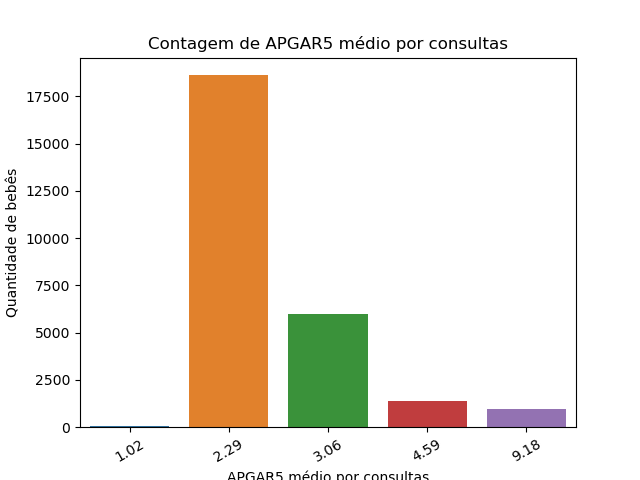
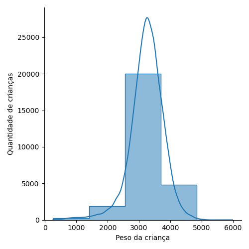
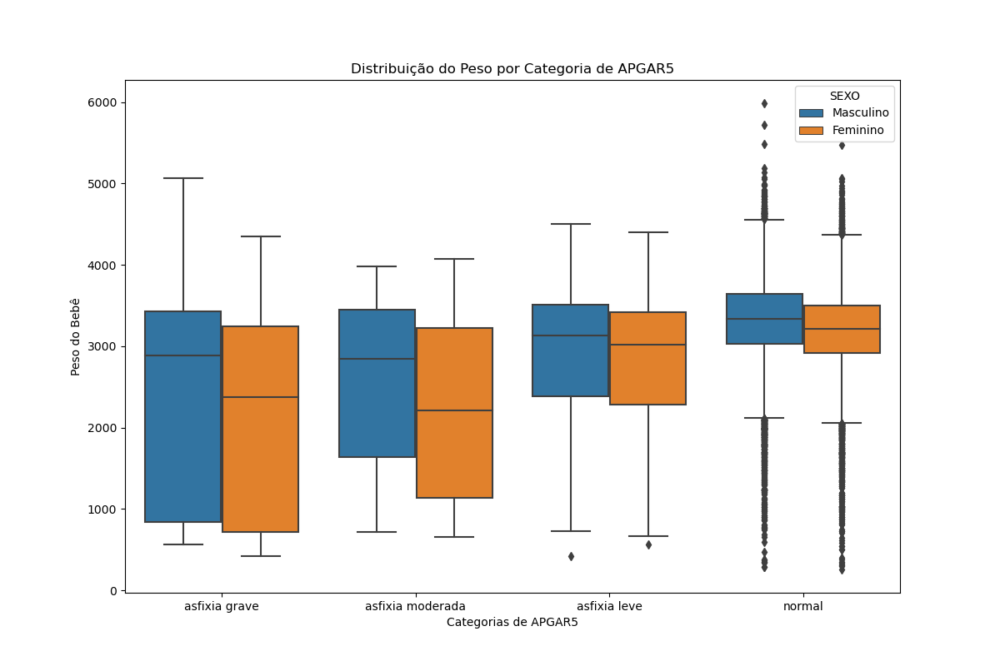

# Análises feitas no módulo 8 do curso de Ciência de Dados da EBAC sobre saúde neonatal e perfil socioeconômico das mães

## Nos seguintes arquivos, estão apresentadas algumas análises sobre a saúde de bebês recém-nascidos e as situações sociais e econômicas de suas mães.

## Na primeira análise, construímos gráficos sobre a situação de saúde dos recém-nascidos, a quantidade de nascimentos separadas por sexo e a situação social e econômica das mães.

### Gráfico com a contagem de APGAR5 médio por consultas

## Na segunda análise, construímos boxplots da idade das mães e do peso dos bebês assim como os histogramas dos mesmos dados.

### Histograma do peso dos bebês

## Na terceira e última análise, fizemos um gráfico de distribuição de APGAR5 por tempo de gestação e sexo, uma tabela cruzada usando o tempo de gestação e as categorias de APGAR5, gráfico de barras e boxplots construídos com os mesmos dados mencionados. 

### Boxplot do peso dos bebês e as categorias de APGAR5

## Esperamos que esta análise seja produtiva para a suas conclusões e sirva para que o atendimento aos bebês e suas mães sejam melhorados, de acordo com as necessidades de cada caso.

